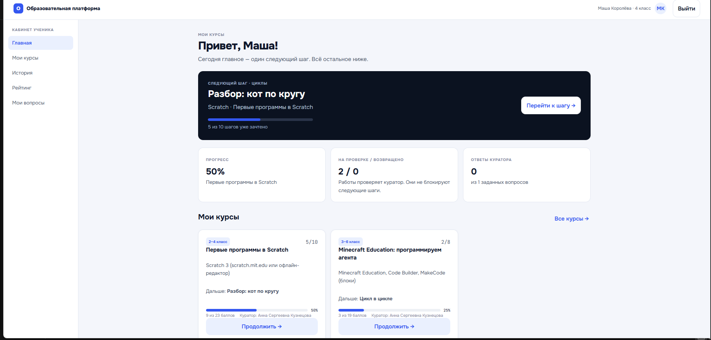
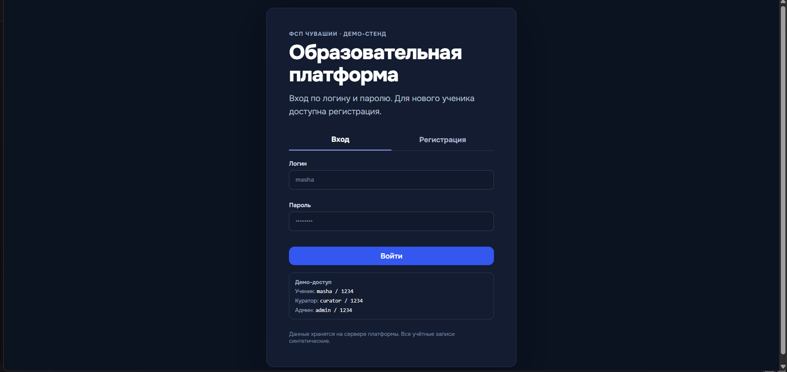
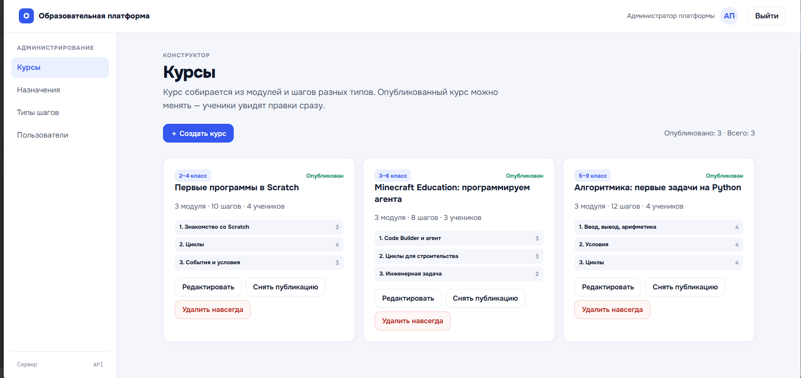
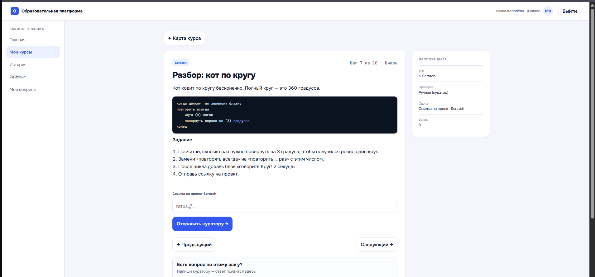
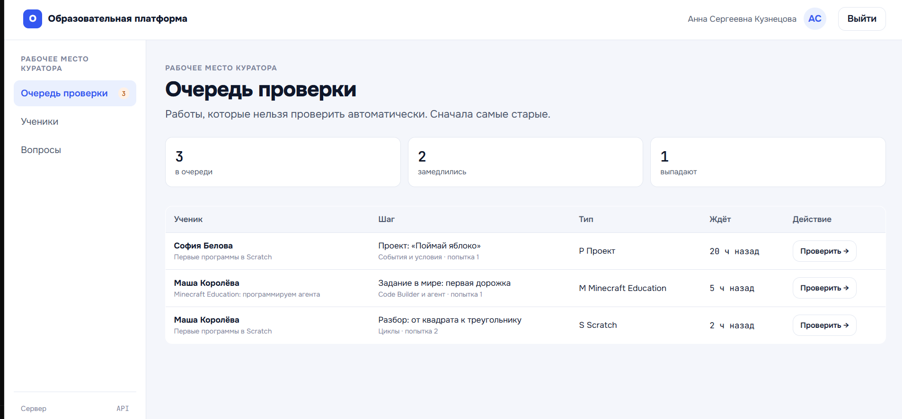

# Kodiki — образовательная платформа для школьников

Платформа для подготовки учеников 1–9 классов к соревнованиям по спортивному программированию. По устройству похожа на Stepik: ученик проходит курсы из шагов, куратор проверяет то, что нельзя проверить автоматически, администратор собирает курсы в конструкторе.

Проект сделан командой из трёх человек на хакатоне **ФСП Чувашии** 26 сентября 2026 года, кейс «Образовательная платформа». Результаты хакатона пока не объявлены.




## Моя роль

В команде я отвечал за **бэкенд на Go** и **выкладку на сервер**:

- REST API для трёх ролей: ученик, куратор, администратор;
- схема базы данных SQLite и загрузка начальных данных;
- авторизация: пароли в bcrypt, сессии по токену;
- автоматическая проверка ответов и запуск решений на Python по тестам с ограничениями по времени и памяти;
- расчёт прогресса, рейтинга и сигналов отставания для куратора;
- выкладка на VPS: systemd-юнит, nginx, HTTPS через Let's Encrypt, автоматический откат неудачного релиза.

Интерфейс сделал [Dfty-tech](https://github.com/Dfty-tech), сервер и GitHub Actions настроил [lomen-Icarus](https://github.com/lomen-Icarus). Исходный командный репозиторий: [lomen-Icarus/kotiki](https://github.com/lomen-Icarus/kotiki). Этот репозиторий — его копия с полной историей коммитов, очищенная для портфолио.

## Возможности

**Ученик** видит на главной один следующий шаг и прогресс по курсам. Отвечает на вопросы и сразу получает результат, решает задачи на Python с проверкой по открытым и скрытым тестам (вердикты OK, WA, TL, RE, CE), сдаёт ручные работы куратору и не ждёт проверки, чтобы идти дальше. Может задать вопрос по конкретному шагу и посмотреть рейтинг с расшифровкой баллов.

**Куратор** работает с очередью ручной проверки: сначала самые старые работы. Принимает работу с баллами или возвращает с комментарием. Видит своих учеников с сигналом «В графике», «Замедлился» или «Выпадает» и причиной: давно не заходил, застрял на шаге, отстаёт от группы, не исправил возвращённую работу.

**Администратор** создаёт и публикует курсы, собирает их из модулей и шагов, добавляет новые типы шагов прямо в интерфейсе, записывает учеников на курсы и назначает кураторов.

В базу загружено учебное содержание от организаторов: 3 курса (Scratch, Minecraft Education, Python), 9 модулей, 30 шагов.

## Скриншоты

| Вход | Конструктор курсов |
|---|---|
|  |  |
| **Шаг курса** | **Очередь проверки куратора** |
|  |  |

## Стек

| Часть | Технологии |
|---|---|
| Бэкенд | Go 1.27, стандартный `net/http`, SQLite (`modernc.org/sqlite`, без CGO), bcrypt (`golang.org/x/crypto`) |
| Проверка кода | Python 3 в отдельном процессе с лимитами |
| Интерфейс | HTML, CSS, JavaScript без фреймворков |
| Выкладка | Linux, systemd, nginx, Let's Encrypt, Bash |

## Архитектура

Главная идея — **тип шага и способ проверки независимы**:

- **тип** отвечает за то, как шаг выглядит: теория, вопрос, Scratch, Minecraft, задача, проект;
- **способ проверки** — один из четырёх: засчитывается при прочтении, сверка ответа, прогон кода по тестам, проверка куратором.

Способы проверки реализуют один интерфейс `Checker` ([backend/internal/steps/checkers.go](backend/internal/steps/checkers.go)). Все шаги лежат в одной таблице, а различия хранятся в двух JSON-полях: что видит ученик и что от него скрыто (ответы, тесты, критерии). Поэтому новый тип шага не требует ни новой таблицы, ни правки сервера, а новый способ проверки — это новая реализация `Checker`.

Любая сдача, автоматическая или ручная, пишется в одну таблицу `submissions`, по ней считаются прогресс и рейтинг. Поэтому работа, принятая куратором, влияет на прогресс так же, как пройденный тест.

```
backend/
├── main.go            запуск: база → начальные данные → HTTP-сервер
└── internal/
    ├── api/           HTTP-обработчики: ученик, куратор, администратор, прогресс
    ├── db/            схема SQLite и подключение
    ├── steps/         типы шагов и способы проверки
    ├── runner/        запуск решений на Python по тестам
    └── seed/          начальные данные и демо-пользователи
frontend/              интерфейс, который отдаёт сервер
deploy/                скрипты выкладки на VPS, systemd-юнит, конфиги nginx
docs/screenshots/      скриншоты для README
```

Подробнее об устройстве сервера — в [backend/README.md](backend/README.md), все запросы API с примерами — в [API.md](API.md).

## Как запустить

Нужны Go 1.27+ и Python 3 (Python проверяет решения задач).

```bash
git clone https://github.com/daniyalvaleev-png/kodiki-edu-platform.git
cd kodiki-edu-platform/backend
go run .
```

Откройте http://localhost:8080. При первом запуске сервер создаст базу `backend/data/kotiki.db` и загрузит в неё курсы и демо-пользователей. Пароль у всех — `1234`:

| Логин | Роль |
|---|---|
| `masha` | ученик: работа на проверке, возвращённая работа, рейтинг |
| `ivan` | ученик: курс Python и проверка кода тестами |
| `curator` | куратор: очередь проверки, сигналы отставания |
| `admin` | администратор: конструктор курсов, типы шагов, назначения |

Все имена и данные вымышленные.

Настройки задаются переменными окружения, по умолчанию менять ничего не нужно:

| Переменная | По умолчанию | Что задаёт |
|---|---|---|
| `PORT` | `8080` | порт |
| `HOST` | все адреса | адрес, на котором слушать |
| `DB_PATH` | `data/kotiki.db` | файл базы |
| `UPLOAD_DIR` | `data/uploads` | куда сохраняются файлы учеников |
| `STATIC_DIR` | `../frontend` | папка с интерфейсом |
| `PYTHON_BIN` | ищет `python3` | чем запускать решения |

## Ограничения и что можно улучшить

- **Песочница для кода учеников неполная.** Решение запускается отдельным процессом с лимитами 256 МБ и 2 с процессора, но от того же пользователя, что и сервер. Для настоящей эксплуатации нужен отдельный контейнер или Judge0.
- Загруженные файлы отдаются по прямой ссылке со случайным именем, без проверки прав.
- Проверяется только Python.
- Нет восстановления пароля и уведомлений.
- Нет автотестов бэкенда.

## Лицензия

MIT, © команда kotiki. Текст — в файле [LICENSE](LICENSE).
